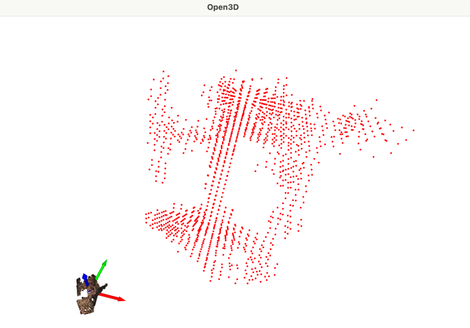

# 3D-VAEGAN for Common Objects in 3D (CO3D)

This repository contains tools and code for working with the CO3D dataset to train 3D-VAEGAN models that can generate 3D shapes from 2D images.

## Files Overview

### `co3d_ply2voxel.py`

This script converts point cloud (PLY) files from the CO3D dataset into binary voxel (binvox) representations that can be used for training 3D-VAEGAN models.

#### Data Structure Assumptions

The script assumes the CO3D dataset is organized in the following structure:

```
input/
└── chair/                        # Category folder
    ├── 58_3353_10266_processed/  # Processed sequence folder
    │   ├── images/               # RGB images
    │   ├── masks/                # Segmentation masks
    │   ├── depths/               # Depth maps
    │   ├── depth_masks/          # Depth validity masks
    │   └── poses/                # Camera poses
    └── 58_3353_10266_dataset_instance/  # Dataset instance folder
        ├── pointcloud.ply        # 3D point cloud
        └── ...                   # Other metadata
```

The script expects each sequence to have both a `_processed` and a `_dataset_instance` version, where:
- The `_processed` folder contains poses and meta pose json
- The `_dataset_instance` folder contains the point cloud file (`pointcloud.ply`), RGB images, masks, depths, and poses

#### Usage

```bash
python co3d_ply2voxel.py --dataset_root=/path/to/input --categories chair --voxel_resolution=32 --visualize=true
# example
co3d_ply2voxel.py --dataset_root=/Users/yuyangtian/Documents/NEU/CS5330/3D_VAE_GAN/input --visualize=t 
```

Parameters:
- `--dataset_root`: Path to the root directory containing the dataset (required, must be absolute path)
- `--categories`: Categories to process (default: ['chair'])
- `--voxel_resolution`: Resolution of the voxel grid (default: 32)
- `--visualize`: Whether to visualize a sample of the output (default: False) you can use yes, t, true or 1, the input will be converted to boolean

The script:
1. Scans the dataset structure to find matching sequence pairs
2. Loads point cloud data from the PLY files
3. Converts point clouds to voxel representations at the specified resolution
4. Saves the voxels as binvox files in the same folder as the source point cloud
5. Optionally visualizes a sample of the point cloud and voxel representation

#### Visualization

When `--visualize=true` is specified, the script will display:
- The original point cloud (with original colors)
- The voxelized representation (in red)
- A 3D coordinate frame for reference
- they're not positioned in the same location in 3D space. This is because the voxel coordinates are in grid space (usually starting from [0,0,0]) while the point cloud is in its original world coordinates.
- The size difference is because the voxel representation is displayed in its raw grid space, while the point cloud is in its original world coordinates.
Result image for `58_3353_10266_dataset_instance`



### `main.py`

This is a skeleton file intended to serve as the entry point for training and testing different variants of 3D-VAEGAN models. It includes a comprehensive argument parsing system but currently does not implement the actual training or testing functionality.

#### Model Variants

The skeleton file provides infrastructure for several model variants:
- `3DVAEGAN`: Basic single-view 3D-VAEGAN
- `3DVAEGAN_MULTIVIEW`: 3D-VAEGAN with multiple views
- `3DVAEGAN_POSE`: 3D-VAEGAN with pose information
- `3DVAEGAN_MULTIVIEW_POSE`: 3D-VAEGAN with multiple views and pose information

These functions need to be implemented in separate files and imported into `main.py`.

#### Usage

```bash
python main.py --alg_type=3DVAEGAN_MULTIVIEW --obj=chair --batch_size=32
```

The script provides extensive command-line options for customizing model behavior, directory structure, and training parameters.

## Getting Started

1. Structure your CO3D data according to the expected format
2. Run the voxelization script to convert point clouds to voxels
3. Implement the training and testing functions for your desired model variant
4. Use the main.py to train and test your model

## Dependencies

- NumPy
- Open3D
- tqdm
- PyTorch (for training)

## Notes

- The binvox format stores only binary occupancy information (whether a voxel is filled or not) and does not include color information.
- The voxelization process includes a padding factor (default 0.05) to prevent clipping at the edges of the point cloud.
- Point cloud visualization uses the original colors from the PLY file if available.